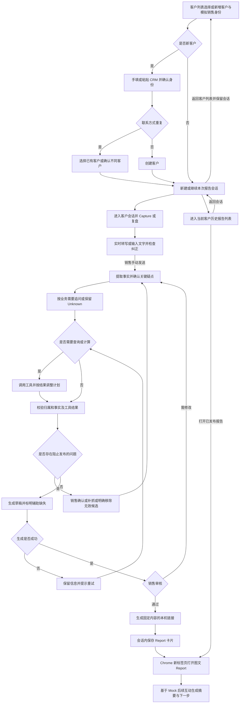
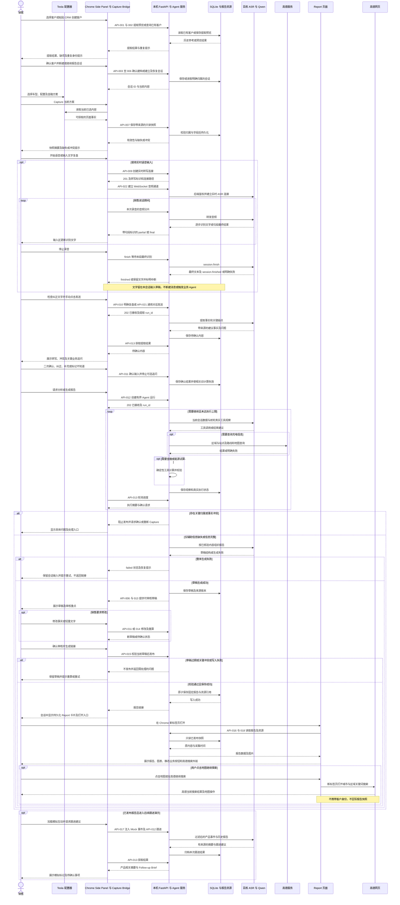
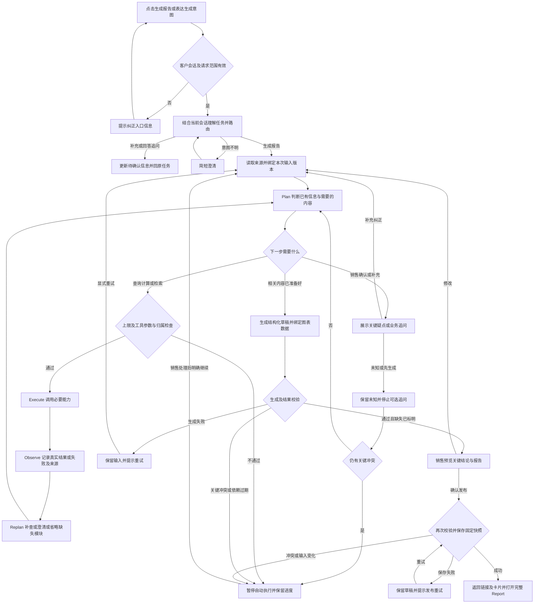
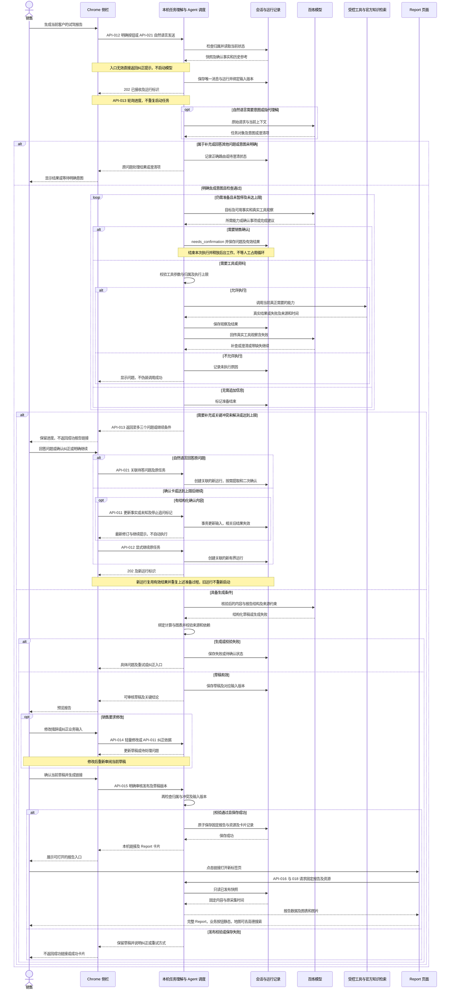

| 字段 | 内容 |
|---|---|
| 作者 | Evan |
| 日期 | 2026-09-20 |
| 事项 | Tess-Chrome 销售侧插件 Demo 的需求范围与验收 |
| 版本 | v4.1 |
| 状态 | Draft；2026-09-20 场景收敛已口头确认，整份需求待用户看完本稿后再标 Confirmed |

# Tess-Chrome 产品需求

## 用户目标与完整流程

面向 Tesla 销售顾问，在试驾结束至客户下单前，整理候选方案、补齐决策信息、生成试驾报告，并辅助后续跟进。

本次演示验证销售工作流能否走通，不以实际成交提升作为验收结果。产品切入点来自用户的一次亲身试驾体验：离店后缺少可以带走、与家人讨论的复盘材料，需要自行重新整理。该观察不代表 Tesla 全部销售的现行流程，也不作为认定销售失职的依据。

销售通过简短自然语言复盘，交由 Agent 整理事实、按业务需要追问和查询，生成可审核的决策材料。几十秒至一两分钟是期望的复盘输入体验，不代表已经测得的全流程耗时。业务价值假设是减少重复解释、帮助家庭共同决策并改善后续跟进，需要后续验证。

面试插件 Demo 主线（2026-09-20 收敛）：

**建档 → 抓配置 → Agent 解决复杂金融决策 → Agent 辅助销售答疑 → 补充 Context → 生成 / 展示 Report**

真正要重点展示的两个 AI Moment：

1. **金融 Planning + Tool Calling**（Constraint-based Decision Planning）
2. **复杂问题 Knowledge Retrieval**（快速带过，不抢金融主线）

其余能力服务于同一目标：把客户离店前最有价值的决策信息沉淀下来，供离店后继续讨论。充电分析与能源成本**仍是 Report 内容**，不是被删除的能力；只是现场演示不单独开一条充电主线。

五段现场场景：

1. 到店前粘贴 CRM（演示用预生成假文本）→ 建立本次客户档案。
2. 官网选配后保存候选，最多 3 套对比。
3. 自然语言金融约束 → 澄清 → Finance Tool → 不满足则再规划 → 给出 Trade-off。
4. 插件内 Ask Tess：自然语言 → 查询**假数据知识库** → 答案带来源；短演示。
5. 语音或文字补充关注点 / Must-have / 可妥协 / 未决问题 → 汇总档案+候选+问答+补充 → Preview。面试展示 Report 时，使用**预先在 Chrome 打开的假 Report 页**，不是真的发送链接。

操作按钮文案（含是否叫 Capture / Save to Tess）等各页内容对齐时再定，本轮不锁文案。

语音录入：演示允许**假语音录入**；真麦、停止、迟到等细节留到做到该场景时再细化，不在本轮写死。

核心流程（产品能力，含按需模块）：

**选择或创建客户 → 新建或继续本次报告会话 → 保存官网候选 → 文字或（可模拟的）语音补充 → 确认关键疑点 → Agent 按需金融规划、知识检索、充电/能源等工具 → 准备 Report → 销售审核 → 本机链接或面试用预开 Report 页。**

销售无需逐项启动地图查询、金融规划和成本计算。充电与能源按需进入报告，不要求每个客户都执行全部分析。

交付目标：2026-09-21 下午面试前达到稳定可演示状态。

## 本次范围

| 能力 | 本次实现边界 |
|---|---|
| 产品入口 | Chrome Side Panel，配合 Tesla 中国 Model Y 配置器使用 |
| 销售身份 | 展示模拟的已登录销售身份，例如 Alex；不实现登录、注册、账号验证或账号切换 |
| 侧栏导航 | 客户列表、客户会话、历史报告列表逐层切换；完整 Report 在新标签页打开 |
| 客户与会话 | 一个客户档案关联多次试驾报告会话；支持继续当前会话、查看历史报告 |
| CRM 信息录入 | 销售手动粘贴文本，Agent 提取后由销售确认；不接真实 CRM。面试/联调用**预生成的假 CRM 文本**（含 C 二麦等案例数据），到实现该场景时再生成具体粘贴稿 |
| 车型采集 | 从真实官网页面读取当前选中的方案；按钮文案待逐页界面确认 |
| 销售复盘 | 支持直接文字输入。演示可用假语音录入；真实时 ASR 细节待该场景再定，不以真麦作为本轮 Demo 主线门槛 |
| 知识问答 | 插件内 Ask Tess 查询**假数据官方知识库**（资料待该场景生成），返回答案及来源；短演示，不抢金融主线。报告页 Ask Tess 等业务按钮仍为静态展示 |
| 充电分析 | **保留**。真实接入高德，查询区域、站点、距离及路线；作为 Report 模块与按需工具，不是被删范围 |
| 能源成本 | **保留**，作为 Report 模块；数据不足时标明缺失 |
| 大模型 | 百炼 `qwen3.7-plus` 真实接入，保留 Provider Adapter；型号资料已核验，账户可用性与效果仍需实测，见技术方案 |
| Tesla 内部能力 | CRM、内部车型与金融接口、活动接口使用明确标注的 Mock 数据 |
| 金融与能源成本 | 使用确定性工具计算，展示输入条件与估算性质 |
| Report | 可根据本次客户信息生成本机链接。面试主路径：预先打开一份**假 Report 页面**给面试官看，不实现真发送（邮件/微信等） |
| Report 内部按钮 | Ask Tess、分享、联系与预约等业务按钮静态；地图图片及“在高德继续搜索”可真实打开外部地图。插件内知识问答见上表，与报告页静态按钮不是同一入口 |
| 后续客户互动 | 使用 Mock 对话或事件生成销售侧摘要 |
| 公网与手机访问 | 不在本次范围内 |
| 下单与支付 | 不在本次范围内 |
| 客户管理与报告版本 | 不做复杂客户管理、档案合并、版本对比或回滚界面；已生成链接内容固定 |

官网 Capture 是真实来源；Mock 接口返回值不能覆盖或冒充官方页面事实。

## 核心业务规则

### 客户、会话与报告的归属

- 客户档案保存称呼和联系方式；称呼必填，手机号或邮箱至少一项。联系方式用于销售侧识别，报告正文默认不展示。
- 每次试驾或需要独立复盘的跟进建立一次报告会话。继续未完成的复盘时打开原会话，不自动新增。
- Capture、录音、上下文、计算和报告均归属于明确的客户及会话；未确定归属前不可 Capture 或开始报告录入。
- 新会话可以沿用客户身份；历史预算、偏好和顾虑仅作带来源的参考，不直接作为本次已确认事实。新反馈与历史信息冲突时请销售二次确认，并保留历史记录。
- 同一客户多次试驾属于多次业务会话，不是同一报告的版本管理。
- 实际试驾车型与候选购买方案分开记录。前者由销售复盘或试驾记录确认，后者来自官网 Capture；驾驶、加速、后排等实际体验只关联实际试驾车型。试驾版本未知时保留未知，不用第一个候选方案代替，不把对某版本的体验套用于另一版本。

### 审核与修改权限

| 内容 | 销售可执行的修改 |
|---|---|
| 称呼、关系、试驾反馈、预算与顾虑 | 纠正或补充，记录为销售确认的信息；销售转述不冒充客户直接反馈 |
| 总结、措辞、详略 | 调整表达或删减，但不能改变来源事实与不确定性标记 |
| 官网车型、配置、价格、金融快照 | 回官网调整后重新 Capture，不直接手改快照 |
| 地图结果 | 修改查询区域并重新查询，不手改站点距离或驾车时间 |
| 金融与成本计算结果 | 修改输入条件后重算，不直接编辑输出数字 |

MVP 审核采用结构化信息纠正、首屏总结及待确认事项文字修改、自然语言修改意见后重新生成三种方式；不做完整富文本报告编辑器、拖拽排版或任意图表编辑。

审核首先展示关键结论、疑点及受影响内容，完整报告提供预览。普通信息汇总确认；冲突、异常及影响判断的关键不确定项单独突出。销售纠正某项输入后，其下游计算和草稿必须重新生成或标为待更新，不能保留旧结论冒充最新结果。

### 发布与部分失败

- 未发布草稿可修改和重新生成；销售审核后生成固定内容的本机链接。
- 后续修改生成新报告和新链接，旧链接仍展示原内容及生成时间。销售侧默认展示最新一份，历史报告可查看；不提供版本对比、回滚或专门的版本管理界面。
- 固定报告反映生成时的方案与判断；车型、价格、金融等动态内容展示各自来源及采集时间，不用报告生成时间代替来源时间，不声称打开时仍有效。更新来源后需审核并生成新链接，MVP 不做后台自动刷新旧报告。
- 辅助信息缺失可以带着明确缺失发布；客户归属不清或影响核心结论的事实冲突必须先解决。

| 情况 | 用户可见结果与继续方式 |
|---|---|
| ASR 失败 | 保留已收到的文字并标识识别中断；未识别部分可重说或手填，销售检查后手动发送；已有快照和会话信息保留 |
| 地图查询失败 | 允许生成其余报告，说明查询未成功，不给出充电便利性结论 |
| 成本输入不足 | 省略成本图与节省金额，说明所缺条件，不为凑图强制追问 |
| 金融试算失败 | 有有效完整官方金融快照则展示快照，否则标为待确认，不冒充试算成功 |
| 某个候选方案抓取不完整 | 提示补抓，或由销售明确移除该候选后继续，不静默删除；如无有效候选，不能发布车型决策报告 |
| 客户归属不明、核心价格或预算冲突 | 阻止发布，先确认归属、请销售确认输入或重新 Capture 官方事实 |
| 整体报告生成失败 | 保留输入并允许重试，不返回成功链接 |

发布门槛分三层：客户归属、候选车型版本、当前已选配置识别及来源时间不清楚时，该候选不能作为有效候选发布；价格或金融条件等某项结论的必要输入缺失时，停止该项比较或计算；交付时间、补充性能参数、能源成本等辅助信息可以缺失并明确标注或省略。至少保留一个有效候选，不为凑比较图虚构第二个方案。

技术方案需验证各已选配置字段的实际读取范围，并列出最小有效快照清单及动态信息校验规则。若官网限制导致上述门槛无法实现，应回报具体体验取舍，不自动降低门槛。

## 需求与验收

### REQ-001：Capture 当前候选方案

销售先选定客户和本次报告会话，在指定的 [Model Y 官方配置器](https://www.tesla.cn/modely/design#overview) 完成选择后，点击 Capture，保存当前方案的只读快照。

用户进一步明确，本次仅采集上述 Tesla 中国区 Model Y 配置器，限定 `www.tesla.cn` 的 `/modely/design` 页面；站内不同 Model Y 版本与选配仍按当前选中状态读取。真实 Capture 验收必须在这一官网页面完成。2026-09-20 用户补充授权：先实现真实插件并独立验证；如真实采集方案无法通过有界验证，则允许回退明确标记的 Mock 官网方案并继续剩余开发。Mock 不能记作真实 Capture 验收通过，必须保留失败证据与来源标记。

覆盖车型、配置、参数、交付信息、价格，以及当前页面可获取的金融信息。每条快照保留来源 URL、抓取时间和数据来源。

每次报告会话最多保留 3 个当前候选方案，支持查看、删除以及标注 Evan／Mia／Shared 等偏好归属。修改官方事实需返回官网重新配置并 Capture；MVP 按新增快照处理，需要腾出名额时由销售明确删除旧候选。删除当前候选不会改变已生成报告的内容，其他会话不受影响。

- **AC-001**：改变官网选配并完成页面更新后再次 Capture，新快照与页面当前选中结果一致，旧快照保持不变。
- **AC-002**：字段无法读取、页面尚未就绪或金额存在冲突时，明确显示问题，不用模型补全；关键问题未解决前不得将方案标为完整。
- **AC-003**：已有 3 个方案时，继续 Capture 提示先删除一个，不静默覆盖。
- 验证：在真实官网页面逐项对照快照，并检查异常提示。

### REQ-002：语音复盘与缺失信息澄清

销售通过文字描述试驾情况；演示阶段可用假语音录入代替真实麦克风。假语音一旦作为“已录入文本”进入输入框，仍须由销售检查并手动点击发送（或该场景确认后的等价提交动作），才提交到本次会话并触发 Agent。未发送不得写入已确认 Context、触发查询或生成报告。

真麦、边说边出字、权限拒绝、迟到覆盖等，留到做到语音场景时再细化验收，不在本轮把真实 ASR 当作 Demo 主线必过项。已有 AC-004 / AC-006 保留含义，待该场景细化时决定演示走假录入还是补真麦。

发送后系统再提取人物关系、偏好、反馈、预算、里程、充电条件及未决问题。若该场景启用真实 ASR：中间结果不得直接写入已确认 Context；“未发送”指尚未作为会话消息交给业务 Agent。

人物信息需区分实际同行者、未到场家庭成员，以及由销售转述的反馈。ASR 转写允许销售纠正后再使用。

除缺失字段外，Agent 根据业务 know-how 识别可能改变当前建议的重要信息，例如：没有固定车位时是否知道公司充电条件、配偶未到场时是否提过共同确认后排体验、月供目标明确时是否知道首付上限。规则是本 Demo 的候选业务规则，不宣称为 Tesla 现行 SOP。

优先合并展示与当前决策相关的问题，销售可回答“不知道”或“客户没提过”。不为填满画像持续追问，不要求销售替客户猜测。识别为异常的金额、ASR 疑点，以及 CRM、历史反馈和本次输入之间的冲突需二次确认，不能自动选择一个值覆盖其他来源。

初版每轮优先展示最影响当前判断的 1—3 个问题，提供“暂不补充，先生成报告”。未知项进入待确认内容；只有身份或关键事实冲突需要强制确认。销售选择先生成后停止可选追问，不以换一个问题的方式继续阻塞生成。

- **AC-004**：录音尚未停止时能看到真实 ASR 逐步返回的文字；停止后可查看和纠正最终文本，只有手动点击发送才新增会话消息并提取 Context。停止录音或识别完成不会自动发送、查询或生成报告；提取内容以实际发送文本为准。
- **AC-005**：缺少分析所需的信息时提出具体问题；回答“不知道”后保留 Unknown，并说明补充信息能支持什么结果。
- **AC-006**：录音权限被拒、连接中断或转写失败时显示原因或可执行提示；保留已收到文字，标明本段未完整识别，允许重说未识别部分或改用文字并手动发送，不生成虚假复盘。后到的转写不得覆盖销售已修改或已发送的文本。
- **AC-027**：输入含“无固定车位”等关键线索时，提出与当前判断相关的业务追问；回答不知道后保留未知，不循环追问同一已明确未知项。
- **AC-028**：CRM、历史输入与本次 ASR 存在预算冲突或异常金额时，显示待确认内容及来源；销售确认前不据此发布金融结论，确认后下游使用确认值且不改写历史会话。
- **AC-035**：实际试驾车型与候选车型不同时，反馈保持正确归属；试驾版本未知时明确标注，不继承候选版本作为体验事实。
- **AC-036**：一轮展示不超过 3 个优先问题，销售选择先生成后不再被可选追问阻塞；关键冲突仍需处理，未知项如实进入报告。
- 验证：使用正常录音、含金额及人名的录音，以及缺失信息案例走查。

### REQ-003：充电顾虑分析

根据常用区域查询周边 Tesla 相关充电设施，展示地图、站点、距离与驾车时间。无需精确门牌地址。

Report 内使用本次查询生成的真实静态地图与站点列表。点击地图图片或“在高德继续搜索”，在 Chrome 新标签页打开高德搜索页面，带入已确认城市及常用区域相关关键词，用户可以在高德继续搜索和操作地图。Report 内不嵌入可拖动缩放的地图，不因打开外部地图修改报告快照。

高德网页搜索支持 PC；其 `center` 参数只在移动端有效。因此桌面入口按城市与区域关键词检索，不承诺外部页面精确复现报告的中心、半径或站点排序。链接仅包含查询所需地点信息，不包含客户称呼、联系方式或 CRM 文本。外页显示高德当时的结果，可能与报告生成时不同。[高德官方搜索链接说明](https://lbs.amap.com/api/uri-api/guide/search/search)

充电时长和补能频率只在有足够输入及可靠依据时估算。地图 POI 不等同于站点实时可用状态。

- **AC-007**：输入有效区域后，通过真实高德服务获得结果，地图与列表对应，并说明距离口径。
- **AC-008**：区域未知、查询失败或无匹配站点时分别展示对应状态，不填入示例站点冒充真实结果。
- **AC-009**：充电时长、补能频率估算展示依据和假设；依据不足时保留待确认，不直接认定“没有家充也方便”。
- 验证：核对实际工具返回与页面展示，走查缺失和失败分支。

### REQ-004：自然语言金融规划

理解月供、首付、期限和融资成本等约束，基于可用金融产品调用计算工具，输出满足条件的候选组合。

本次金融产品接口使用 Mock，结果明确标注为演示试算。基于真实金融快照条件的调整计算同样属于试算，不能冒充已重新获得官方确认。销售选定后，需回官网核对并重新 Capture 才能成为新的已确认官方方案。

Mock 产品不保证真实官网支持。找不到对应官方产品时，保留待官方确认的演示建议，不自动转换为已确认方案；报告中的已确认金融方案和演示建议必须分开。完整主链演示采用现场官网核验后可复现的条件，若无法复现，明确展示未确认分支，不伪造闭环。

- **AC-010**：给定约束后，每个推荐组合均满足已声明的硬性条件，并展示首付、期限、月供和总融资成本。
- **AC-011**：没有满足全部条件的方案时，说明未满足的条件，不伪造推荐结果。
- **AC-012**：试算不会修改已抓取快照；金额冲突或优惠缺项必须显式提示。
- **AC-037**：Mock 金融产品在官网无对应方案时，不标为官方已确认；真实快照、调整试算和 Mock 建议来源清楚，重新 Capture 后才更新当前官方候选。
- 验证：用独立计算结果核对数字，并测试约束无解场景。

### REQ-005：通过 Agent 准备并校验 Report

Agent 根据快照、CRM、销售复盘和缺失状态规划所需步骤，真实调用工具，根据结果继续补查或保留缺失，最后生成报告草稿。

销售可看到简洁的任务步骤、工具状态、结果摘要和待确认项，不展示模型内部思维过程。执行步骤随信息需要变化，不强制每次跑相同轮数。

按需执行：有家充且无充电顾虑时不强制查询周边站点；已有满足要求的已确认金融方案且无新约束时不重复规划；没有能源成本诉求或输入不足时不为完整排版强行计算。销售仍可主动请求相关分析。

- **AC-013**：信息齐全时完成必要检查；信息不足时，能基于工具结果追加必要步骤，或明确保留缺失。
- **AC-014**：生成前区分官网事实、销售输入、客户反馈、Mock、Estimate 和 Missing，并检查冲突及动态信息时间。
- **AC-015**：工具失败时明确显示受影响内容，不以固定成功动画或模型猜测冒充执行成功。
- **AC-029**：使用不同需求的客户案例，执行记录体现工具选择差异；无必要时跳过相关分析，而非固定运行全套工具。
- 验证：分别运行信息完整、需补充信息及工具失败案例，核对执行记录与报告内容。

### REQ-006：生成可查看的图文 Report

以用户提供的 Report 为内容参考，首屏优先展示“现在比较什么、已经明确什么、还需确认什么”，再按相关性展开试驾信息、候选方案、金融、充电、能源成本、家庭关注点、销售联系信息及来源时间。不强制展示所有分析模块；不把未知事项归入已明确结论。

销售审核后生成链接，在演示电脑 Chrome 新标签页打开。本次客户数据变化应反映在新生成的报告中。

发布成功后在本次会话中保留一张 Report 卡片，展示报告名称、生成时间和打开入口；草稿或发布失败不得出现可打开的成功报告卡片。客户会话顶部同时提供“历史报告”入口，进入该客户跨会话的报告列表；按时间查找即可，不要求向上翻完聊天。历史列表与对话卡片引用同一份已发布报告，点击均在 Chrome 新标签页打开，不复制报告，也不提供版本对比。

- **AC-016**：链接打开后展示审核对应的报告内容，不能始终指向一份固定示例。
- **AC-017**：Report 页的 Ask Tess、分享、联系销售等按钮仅作静态展示，不触发真实业务操作。插件内知识问答见 REQ-009，不是本条。
- **AC-018**：支持车型参数对比图、月供与预算线、充电地图、累计能源成本图；数据不足时标明缺失，图表与正文数值一致。
- **AC-019**：能源成本展示里程、电耗、电价、油耗、油价和周期等假设，不将能源节省描述为整车总持有成本节省。
- **AC-030**：审核界面支持按上述内容权限纠正或重新获取信息；修改预算、区域或成本假设后，相关结果刷新或明确标为待更新，旧计算不能直接发布。
- **AC-031**：发布报告后修改输入并重新生成，新链接展示新内容，旧链接仍保持旧内容；刷新或关闭重开浏览器后，本机服务正常运行时仍可访问已生成报告。
- **AC-032**：地图失败或成本数据缺失时可以审核并生成标明缺失的报告；核心归属或事实冲突未解决时不能发布；整体生成失败不返回成功链接。
- **AC-033**：首屏能看到当前对比、已明确内容和待确认事项；联系方式默认不出现在报告正文，各模块只展示当前会话对应内容。
- **AC-038**：报告生成时间晚于 Capture 时间时，动态字段仍显示原采集时间；再次打开旧链接不会自动把其来源时间刷新为当前时间，也不宣称旧价格仍有效。
- **AC-041**：报告发布成功后，会话中出现且重开后仍可找到对应 Report 卡片；从卡片与该客户历史报告列表打开的是同一 report_id 对应内容。跨会话历史报告均可找到，未发布草稿不混入列表；重复受理同一次发布不新增重复卡片。
- **AC-043**：点击真实静态地图或“在高德继续搜索”可在 Chrome 新标签页进入包含城市及区域关键词的高德搜索；URL 不含客户身份、联系方式、CRM 文本或服务密钥。返回 Report 时原地图、列表与来源时间不变；缺少已确认查询区域时不伪造定位链接，外部页面不可用时仍可查看原报告。
- 验证：从销售审核到新标签页完整走查，逐项核对图表与数据。

### REQ-007：客户动态摘要与跟进辅助

基于模拟的报告后互动，展示新动态提示、精简 Report Card、近期关注点、已解决问题和仍待确认的问题。

销售可询问“今天联系客户最值得聊什么”，获得结合历史报告和新动态的简短 Follow-up Brief。

有答案或完成工具查询不等于客户顾虑已解决。只有存在客户明确反馈或销售确认且记录其依据时，才能标为已解决；否则保留“已提供信息，待确认”。跟进建议指出具体未决事项、已有依据、仍需确认的内容及建议的下一步，不把接收信息或活跃度等同于成交意愿。

- **AC-020**：注入不同 Mock 互动后，摘要和跟进建议随之变化，能够追溯到对应的产品相关信息。
- **AC-021**：销售侧不展示家庭成员完整私人聊天；互动频次或活跃度变化不得直接转换为购买意愿判断。
- **AC-034**：仅查询到站点或回答版本差异时，不自动标记客户顾虑已解决；有明确确认依据时才改变状态。摘要也不得泄露与购车无关的私人内容。
- 验证：用包含产品问题及私人内容的模拟互动检查摘要边界。

### REQ-008：客户档案、CRM 粘贴与多次报告会话

客户列表提供“新增客户”。新客户可手填或粘贴 CRM 文本，由 Agent 提取称呼、联系方式和已有背景，销售确认并补齐必填项后创建客户和本次报告会话。CRM 文本保留来源性质，不要求先整理成固定格式。演示与面试使用**预生成的假 CRM 粘贴稿**（含用户将提供的 C 二麦等案例），不接真实 CRM 系统。

手机号或邮箱相同仅触发轻量提醒，不按昵称查重、不自动合并档案。销售可进入已有客户新建报告；若确认是不同的人，则允许继续创建。**本轮 Demo 界面不演示查重**（确认后直接建档进入会话）；查重仍是产品能力，见 AC-023，后续版本再做。已有客户默认打开最近会话，可继续未完成复盘，或点击“新建试驾报告”；历史报告收在独立入口，不挤占主操作区域。

侧栏采用单一主工作区：外层显示客户列表及新增按钮，选中客户后切换到该客户最近的报告会话；尚无会话时提供开始本次报告的入口。客户列表不与会话常驻并排。会话顶部显示当前客户、返回／切换客户、历史报告及新建试驾报告入口；Capture、文字或语音录入、追问确认及报告生成以会话对话和结果卡片承载，具体控件布局留到界面设计。

返回客户列表、进入历史报告或切换客户，不删除已经保存的会话、草稿和运行结果；未发送文字按会话保留，返回时恢复，不能带入另一客户。已提交任务仍写回发起时的会话。录音中导航需提示先结束或放弃录音，不承诺关闭侧栏后仍可采音。

销售身份仅使用统一的 Demo 展示资料（例如 Alex｜销售顾问），可在侧栏头部展示头像、称呼及模拟已登录状态。它不代表真实 Tesla 账号认证；报告的销售顾问模块使用同一份演示身份，不把当前客户称呼误当作销售身份。

- **AC-022**：手填或粘贴 CRM 文本后，展示提取内容供确认；缺少称呼或任何联系方式时提示补齐，确认前不进入报告录入和 Capture。
- **AC-023**：手机号或邮箱相同时提示已有客户并允许进入；同昵称不同联系方式不触发身份合并；销售明确选择不同客户时仍可创建独立档案。本轮 Demo 不验收本条界面。
- **AC-024**：同一客户可新建第二次报告会话，首个会话的候选、复盘及报告保持原状；继续未完成会话不会重复创建。
- **AC-025**：切换客户或会话后，界面持续显示当前归属；后台仍在执行的录音处理、Capture 或工具结果只能写回其发起时的会话，不串入新选中的客户。
- **AC-026**：新会话沿用身份，历史预算与反馈标明历史来源；未经本次确认不得作为本次已确认输入，CRM 粘贴不会覆盖官网快照。
- **AC-039**：打开插件可看到模拟的已登录销售身份，无登录、注册或账号验证步骤；报告销售顾问与该 Demo 身份一致，并与客户称呼区分。
- **AC-040**：在 Chrome 右侧窄面板中，客户列表、客户会话和历史报告列表逐层切换，每次仅一个主视图；进入客户后能返回列表或切换客户，完整报告不在侧栏铺开。
- **AC-042**：在 A 客户会话输入未发送文字并切到 B 客户时，B 不显示 A 的输入；返回 A 后恢复其输入和已保存内容。浏览历史报告不会清空当前会话；录音中导航出现结束或放弃提示，后台结果仍归原会话。
- 验证：分别走查手填、CRM 粘贴、联系方式重复、同名不同人、同客户二次试驾和处理中切换客户。

### REQ-009：插件内知识问答（假数据知识库）

销售在插件中用自然语言提出复杂产品问题（Knowledge Copilot）。系统查询**预置假数据知识库**（官方口吻的演示资料，实现该场景时再生成条目），返回答案并标明来源。本能力用于短演示，不得打断或取代金融 Planning 主线。

知识库不是真实 Tesla 内部系统，也不是现场爬取。答不出时明确说资料不足，不编造无来源结论。报告页 Ask Tess 仍按 AC-017 静态。

- **AC-044**：对知识库中已准备的问题，插件内给出与条目一致的答案，并展示可核对的来源标记；不得把无来源模型发挥标成官方知识。
- **AC-045**：知识库没有对应条目时，说明未找到官方资料，不伪造来源编号或链接。
- 验证：用预生成的命中条目与明显无关问题各走一次；核对金融主线演示不被知识问答抢时长或改状态。

## 流程图与时序图

### 用户流程图

覆盖 REQ-001 至 REQ-008。查询和计算按需执行；辅助失败与关键冲突采用不同处理路径。

### 核心交互时序图

以下按本轮 [技术方案草稿](tech-spec.md) 补齐组件与 API 引用。实时转写须手动发送、静态地图可点击去高德搜索均来自本轮用户选择；原音频不落本机磁盘为技术建议。图不代表真实服务已联调通过。

### 生成报告意图：目标与执行边界

本节专门展开 Case 05 / REQ-005、REQ-006，关联 AC-013—019、025—033、035—038、041。前两张图说明完整销售工作流，本节两张图说明一次“为当前客户生成报告”的任务如何完成。

**业务目标**：整理本次试驾所得，先回答“现在比较什么、已经明确什么、还需确认什么”，形成可供客户带走的决策材料。草稿生成成功与销售审核后发布成功是两个独立完成点。

**入口与输入**：销售点击“生成报告”，或在当前会话表达“帮我整理这次试驾报告”。使用当前客户与会话、实际试驾车型及反馈、候选快照、CRM 历史参考、确认后的复盘、未决事项和有效工具结果。ASR 是上游输入能力，已有确认文字时不再次转写。

**任务理解**：按钮已明确意图，无需额外分类。自然语言结合当前会话理解对象和约束；若只是回答上一轮追问，例如“首付最多十万”，应先归入原任务，不当作新报告请求。意图不明确则简短澄清。需要指代消解或知识检索时才改写 query，保留原文及不确定性，不设置必经的独立改写模型。

**执行架构**：入口检查 → 上下文理解与路由 → 有界 Plan–Execute–Observe–Replan → 结果校验 → 销售审核 → 固定发布流程。知识检索与工具是规划和固定流程共用的能力，不是与 Workflow / Plan–Execute 互斥的分支。图中职责不代表拆成多个 Agent；具体模型调用合并方式仍由技术方案说明。

MVP 采用固定流程与按需规划组合。已知动作不经过完整模型分类链；自然语言任务需要理解时，再结合当前会话判断。风险检查分布在入口、工具执行及发布前，不增加一个能替代后续校验的独立“风控 Agent”。

| 当前请求 | 处理方式 | 与生成报告的关系 |
|---|---|---|
| 点击 Capture、确认事实、确认发布 | 固定流程，直接执行对应校验 | 采集和发布不交给模型自主决定 |
| 回答“首付最多十万” | 关联当前待答问题，提取并核对必要疑点 | 确认后继续原任务，不能误开一份新报告 |
| 询问有来源的产品知识或指定金融试算 | 按范围调用资料检索或确定性工具 | 回答与来源留在本会话，不自动发布报告 |
| “帮我整理这次试驾报告” | 按缺口规划，调用必要能力，观察结果后调整 | 信息已够则准备草稿，缺失则追问或明确省略 |
| “帮我把报告说得简洁一点” | 关联当前草稿，按已有审核权限修改 | 只改表达时不重新查询地图和金融；改业务依据时更新受影响内容 |

每次执行都有限额。需要人工回答时保存问题与已有结果，结束本次后台执行；回答或明确继续后建立关联的新执行记录。销售看到的是同一报告任务继续推进，不必理解内部运行编号，也不会因刷新或轮询重复启动。

| 环节 | 核心判断 | 销售可观察的结果 |
|---|---|---|
| 入口与路由 | 客户会话是否明确，是生成报告还是补充事实/回答追问 | 进入正确任务，或显示具体纠正提示 |
| Plan | 哪些事实可复用，哪些模块与客户相关，还缺哪些影响判断的信息 | 简洁准备步骤，不展示内部思维过程 |
| 业务追问 | 销售是否可能知道关键条件，是否已明确未知或停止可选追问 | 每轮至多三个问题，可以保留未知或先生成 |
| Execute | 工具是否允许，参数及归属是否有效，是否需要官方资料 | 真实查询、检索及计算状态 |
| Observe / Replan | 返回是否有用，是否失败、冲突或引出必要补查 | 补查、澄清，或明确缺失后继续 |
| 草稿校验 | 数字和来源是否一致，依赖是否仍有效 | 可审核草稿或具体阻断项 |
| 审核发布 | 是否审核当前草稿，输入是否变化，是否保存成功 | 固定报告链接及对应 Report 卡片 |

### 生成报告意图专项流程图

入口、工具执行前和结果/发布前分别检查。辅助信息缺失可以省略相关模块；关键归属或事实冲突必须先处理。规划和工具调用受执行上限约束，不无限循环。

修改措辞走轻量审核；修改预算、车型或区域等依据，才重新准备受影响内容。“返回准备”不表示重新查询所有工具。达到上限时先停止；销售明确继续后创建新的有界运行，复用仍有效的结果。Unknown 和停止追问标记参与下一轮规划，不能通过换一个问题绕过停止规则。

### 生成报告意图专项时序图

本图描述职责与异步交互，不代表各职责都是独立服务。工具层包含确定性计算、外部 Adapter 和小范围官方知识检索；不会为了画图新增平台。

按钮明确生成意图走 API-012；自然语言发送走 API-021，后台在同一次运行中理解和分派，不由前端再次调用 API-012。进度走 API-013；确认、审核、发布及查看对应 API-011、014—016、018。两种入口均先保存运行并返回已接收，再进行后台模型处理。当前保持 Draft，不把该方案图或示例当成联调通过证据。

### 主案例走查与面试展示要点

示例：已有两个真实候选快照；销售确认客户无固定车位、年里程约两万公里、月供目标约四千元，客户也关注能源开支，但常用区域未知。此例只说明路径，价格及站点结果以实际数据为准。

1. **Plan**：复用有效快照和确认反馈；判断常用区域会影响补能分析，向销售追问。有满足需求的官方金融快照且无新约束时，不为了报告章节而重算金融。
2. **销售补充**：回答“望京地铁站附近”后确认地点；回答不知道时保留未知，省略具体附近站点结论，不反复逼问。
3. **Execute / Observe**：调用真实地图能力，分别记录成功、无匹配或失败，不能提前写死“附近已有四个站点”。
4. **Replan**：能源计算发现电耗、电价或对标油耗缺失时，可以补问。销售选择先生成后，省略成本图及节省金额，说明补充后可获得什么；不能仅凭年里程生成节省数字。
5. **Validation / Review**：核对反馈与实际试驾车型、金额与来源、失败与未知标记，向销售展示首屏三问和可审核草稿。
6. **Publish**：销售确认后才保存固定报告并返回链接及卡片。草稿成功不等于发布成功，查询成功也不等于客户顾虑已解决。

演示应显示可观察的选择差异：信息齐全时少查一步，信息不足时合理追问，工具失败时调整内容，关键冲突时停止发布。无需人为制造固定两轮调用或假执行日志。

## 界面约定

整体保持 Tesla 与 ChatGPT 的简洁、克制风格。逐页由用户用抽象稿对齐核心结构；Loading、复制成功、空态、失败与页面过渡由实现补齐，不另开需求会。缺关键流程页时在该页提出，不擅自发明业务步骤。

- 黑白灰为主，颜色用于必要状态与图表区分。
- 插件以对话、工具结果和下一步操作为主。
- 录音时显示实时文字，停止后文字留在输入框，销售检查并点击发送；录音按钮和发送按钮含义清晰，不把停止动作做成自动发送。细节留到语音场景页。
- 窄侧栏一次只显示一个主视图。
- 模拟已登录销售身份仅作展示。
- 完整 Report 在 Chrome 新标签页展示；面试可用预开假 Report。
- Report 以车辆图片、关键数字、方案对比和易读图表为主。充电与能源模块仍在报告内。
- 先展示结论，再展示来源、计算条件和待确认事项。
- 不使用缺乏依据的雷达评分、购买意愿分数或装饰性仪表盘。
- 按钮短文案随各页抽象稿再锁，本页只定结构和作用。

### 首屏：到店前工作台（非客户名单）

插件刚打开**不是**用户列表。带客户走过来时，不能一眼看到其他客户姓名与到店信息。

结构（对应用户抽象稿）：

| 区域 | 作用 |
|---|---|
| 顶栏 | 产品名「Tess · 销售工作空间」；「刷新 Demo」重置演示数据；关闭侧栏走 Chrome 原生 |
| 品牌与身份 | Tess 标志；模拟已登录「Alex / 销售顾问 · Demo」 |
| 用户列表 | 进入名单的入口，名单页内容暂缓，不作为首页 |
| 主区 CRM 粘贴 | 到店前销售把 CRM 文本贴进这里建档 |
| 提交 | 上箭头：提交粘贴内容做提取，再进入确认资料 |
| Demo 复制 | 仅 Demo：一键把预生成假 CRM 写入剪贴板 |

2026-09-20：用户确认首页按此 redesign，用户列表页暂缓。

本页由实现补齐、不另要你出图的状态：

- 粘贴区空：可贴、可点 Demo 复制；提交不可用或提示还没有内容。
- Demo 复制中 / 已复制：短反馈后恢复，不跳页。
- 提交后提取中：主区 Loading，禁止连点提交。
- 提取失败：文案留在框里，说明失败、可重试；不假装已建档。
- 提取成功：进入已有「确认身份/补齐必填」流程（REQ-008），不在首屏直接铺出完整档案。
- 刷新 Demo：需一次确认，避免误清；确认后回到本首屏空态。

关联 REQ-008、AC-022、AC-039。用户列表页、确认建档页、进入会话后的工作区等你后续抽象稿，本页不展开。

## Demo 整体验收

- 走通假 CRM 粘贴建档、保存候选、金融约束规划、短知识问答、文字或假语音补充、审核及本机 Report（面试可用预开假 Report 页）。
- 充电地图与能源成本仍按 Report 模块验收：有数据展示、不足则标明缺失；不从范围删除。
- 用未知常用区域和工具失败案例检查降级报告；用预算冲突案例检查发布阻止与二次确认。
- 用同客户第二次试驾和处理中切换客户检查数据归属，重复演示不能混入其他客户或会话的内容。
- 检查 Report 首屏总结、图表数据、缺失标记及静态按钮，并核对旧链接在再次生成后仍保持原内容。
- 实际点击地图进入高德搜索并核对查询地区与 URL 内容，返回后报告原地图及来源时间不变；外部网页不可用不导致报告白屏。
- 在真实 Chrome 窄侧栏走查列表 → 会话 → Report 卡片 → 新标签页，以及历史报告 → 返回会话；检查模拟销售身份、输入保留、跨客户隔离与报告入口一致性。
- 记录实际操作步骤、追问次数、需纠正内容和耗时，作为体验评估依据；不虚构效率提升或成交影响指标。

## 本轮确认与后续边界

用户已确认：客户与多次报告会话结构、CRM 文本录入、轻量重复提醒、按内容性质审核、无版本管理界面但固定已发布结果、辅助失败可继续及关键冲突二次确认；已同意覆盖现有 PRD 为 v2.0 Draft。上述规则不再重复询问。

用户在二次复查后暂时同意试驾反馈归属、分层发布门槛、金融 Mock 验证边界、追问停止规则、动态来源时间及轻量审核范围，并明确要求继续技术可行性核验与方案编制。以上作为本轮工作基线，新增体验取舍仍需回报。

用户已确认模拟已登录销售身份、窄侧栏逐层导航、会话内 Report 卡片和独立历史报告入口，并授权补充现有 PRD 与技术方案。用户随后明确 ASR 必须实时转文字，手动点击发送才交给 Agent；该选择替代先前“录完后统一转写”的建议。地图采用静态展示，点击后可以进入高德继续搜索；这是其余 Report 业务按钮静态规则的明确例外。用户随后确认整体技术方案，采用原音频仅实时传输、不在本机落盘；失败保留已识别文字。

2026-09-20 场景收敛（用户确认，写入 v4.1 Draft，整份 PRD 待再确认）：

- 知识库做假数据，到该场景再生成；CRM 粘贴同样用预生成假数据（含 C 二麦）。
- 充电、能源仍是 Report 内容，未删除。
- 语音可做假录入，细节留到该场景再定。
- 各页按钮文案等逐页界面时再定，本轮不锁 Capture / Save to Tess 等用词。
- 面试不真发送；使用预先在 Chrome 打开的假 Report 页给面试官看。
- 2026-09-20 首屏抽象稿：打开插件是到店前 CRM 工作台，不是客户名单；名单经「用户列表入口」进入；Demo 独有复制假 CRM。Loading/复制成功/提取失败由实现补齐。

## 待确认事项

- 首屏理解是否与抽象稿一致（见「界面约定 / 首屏」）。若一致，下一张请给「用户列表」页（今日到店优先、几点来）。
- 各页按钮短文案仍后定。
- 假 CRM 粘贴稿、假知识库、假 Report 到对应场景再生成。
- 假语音录入细节留到该场景页。
- 下列流程页若你不单独出图，实现会按现有 REQ 接上，你可随时改：粘贴后的身份确认、空列表、无今日到店、刷新 Demo 确认。
- 整份 v4.1 仍为 Draft；确认前不改插件代码、不重写技术方案。

## 待技术方案核验

- 真实配置器中各字段的读取方式、页面就绪判断及金融信息读取范围。
- 实时 ASR 的麦克风权限、真实逐步转写、停止收尾与断线恢复，以及百炼服务的账户可用性；模型和实时协议资料已在技术方案核验，仍须凭证联调。
- 高德数据能支持的站点识别、路线与地图展示范围。
- 动态信息的过期规则与冲突处理。
- 本机报告链接的保存与读取方式。
- 外部服务异常时的演示恢复方式；历史快照与 Mock 必须保持清晰标记。
